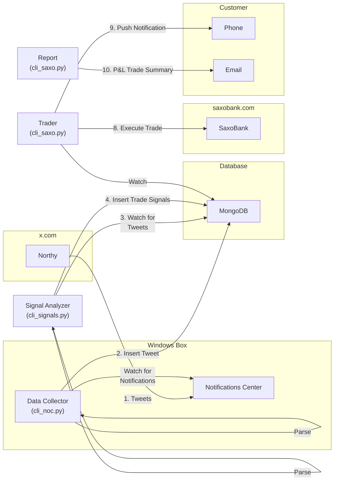

# Project Northy
Automated trading system for Northman Trader (Northy) tweets. The system will monitor Northy's tweets and execute trades based on the signals provided. The system will also send notifications to the user when trades are executed.

## Installation
1. Setup MongoDB Atlas (or local MongoDB)
2. Setup Prowl for push notifications
3. Setup SparkPost for email notifications
4. Setup SaxoBank account and OpenAPI access
5. Update `conf/secrets.ini` and `conf/saxo_config.ini` with your credentials
6. Encrypt the secrets file with `python cli_secrets.py --encrypt [filename]`

## Usage
1. Run `python cli_noc.py --prod watch` on Windows to watch for notifications
2. Run `python cli_signals.py --prod watch` to start the signal analyzer
3. Run `python cli_saxo.py --prod watch` to start the trader
4. Run `python cli_saxo.py --report-closed-positions --job` to generate a report

## TODO
* Get to 100% code coverage
* Run tests using GitHub Actions
* Setup branch protection rules
* Wrap all background jobs into a single threaded service
* Run background services using GitHub Actions?

## Future
* US LLMs to parse alert tweets
* Support executing trades for multiple customers (profiles)
* Support other trading platforms, such as TD365
